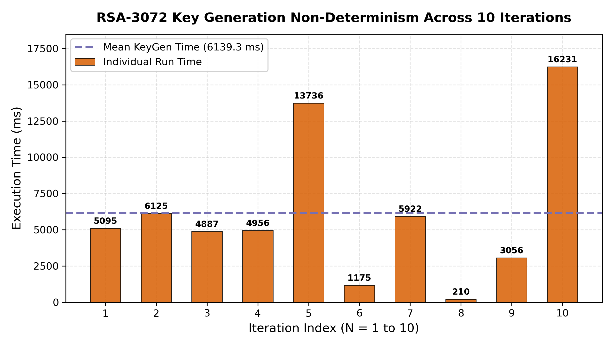

# Phase A: Isolated Micro-Benchmarks (Digital Signatures on ESP32)

Standalone benchmark implementation and results report evaluating digital signature algorithms on the ESP32 microcontroller at an equivalent 128-bit classical security baseline.

The evaluation profiles each algorithm in memory without Wi-Fi or network transport delays to select the optimal digital signature scheme for the embedded VPN client.

## Algorithms Tested

| Algorithm | Curve / Standard | Implementation Library |
| :--- | :--- | :--- |
| **Ed25519** | Twisted Edwards Curve25519 | libsodium |
| **ECDSA P-256** | NIST prime curve secp256r1 | ESP32 mbedTLS |
| **RSA-3072** | PKCS#1 v1.5 with 3072-bit modulus | ESP32 mbedTLS |

## Test Environment

* **Microcontroller:** ESP32-D0WDQ6 (Revision v1.0), Dual Core Xtensa LX6
* **Clock Frequency:** 240 MHz (240,000,000 cycles/second)
* **Usable SRAM:** ~320 KB
* **Measurement Mechanism:** Direct hardware cycle counter register (`ccount`)
  $$\text{Time (ms)} = \frac{\text{CPU Cycles}}{240,000}$$
* **Iteration Count:** 100 runs for fast tests (Ed25519 and ECDSA); 10 runs for slow RSA key generation to prevent watchdog resets.

## Benchmark Results Summary

| Metric | Ed25519 | ECDSA P-256 | RSA-3072 | Winner |
| :--- | :---: | :---: | :---: | :---: |
| **Key Generation Time** | **8.49 ms** | 145.94 ms | 6,139.23 ms | **Ed25519** |
| **Signing Time (64-byte challenge)** | **9.35 ms** | 157.76 ms | 370.13 ms | **Ed25519** |
| **Verification Time** | 19.77 ms | 312.14 ms | **1.66 ms** | **RSA-3072** |
| **Public Key Size** | **32 bytes** | 65 bytes | 384 bytes | **Ed25519** |
| **Signature Size** | **64 bytes** | 70 bytes | 384 bytes | **Ed25519** |
| **Total Wire Overhead (Key + Sig)** | **96 bytes** | 135 bytes | 768 bytes | **Ed25519** |
| **Heap Memory Consumed** | **108 bytes** | 408 bytes | 4,732 bytes | **Ed25519** |
| **Flash Memory Used** | 436,560 B (33%) | 436,560 B (33%) | 436,560 B (33%) | Shared binary |

## Why Ed25519 Was Selected

Ed25519 is the selected digital signature algorithm for the VPN client based on four findings:

1. **Speed:** Key generation takes **8.49 ms** and signing takes **9.35 ms** ($17\times$ faster than ECDSA). Client authentication finishes in under 20 ms total.
2. **Compact Network Payload:** Total handshake payload is **96 bytes** ($8\times$ smaller than RSA's 768 bytes). Smaller packets prevent fragmentation and reduce radio on-time, saving battery.
3. **Minimal RAM Footprint:** Consumed only **108 bytes** of heap memory during execution, compared to **4,732 bytes** for RSA-3072 ($44\times$ more memory).
4. **Deterministic Timing:** Ed25519 uses constant-time execution with predictable latency. RSA key generation is stochastic and ranged from 210 ms to 16.2 seconds across our 10 test runs, causing unacceptable connection freezes.

While RSA verification is faster (1.66 ms), an embedded VPN client must generate keys and sign challenges, where RSA's 6-second keygen and 768-byte wire overhead make it impractical.

## Benchmark Visualizations

### Execution Latency Comparison (Log Scale)

### Communication Payload Overhead

### Dynamic Heap Memory Allocation

### RSA-3072 Key Generation Non-Determinism (10 Runs)

## How to Run the Benchmark

1. Open `Phase_A_Isolated_Benchmark.ino` in the Arduino IDE.
2. Select your board: **Tools > Board > ESP32 Arduino > ESP32 Dev Module**.
3. Set CPU Frequency to **240 MHz**.
4. Connect your ESP32 via USB and select the corresponding COM/Serial port (`/dev/ttyUSB0` on Linux).
5. Upload the sketch and open the **Serial Monitor** at **115200 baud**.
6. The ESP32 will automatically run the benchmarks and print the cycle counts, timings, and memory differences to the terminal.

## Files in this Directory

* **`Phase_A_Isolated_Benchmark.ino`**: Standalone Arduino sketch containing the benchmark implementation for Ed25519, ECDSA P-256, and RSA-3072.
* **`benchmark_report.pdf`**: Complete PDF reference documentation containing KPI definitions, comparison tables, serial output terminal captures, and pseudocode.
* **`graphs/`**: Directory containing the benchmark visualization plots.
