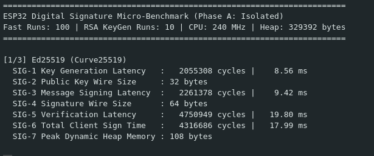
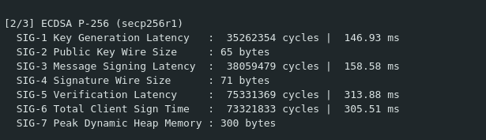
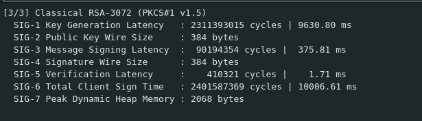
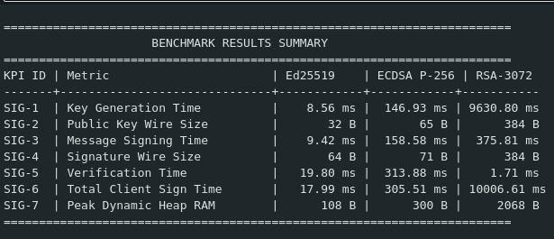
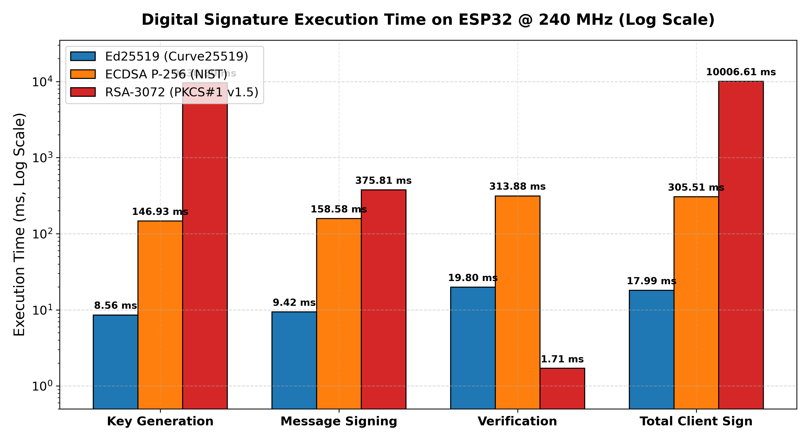
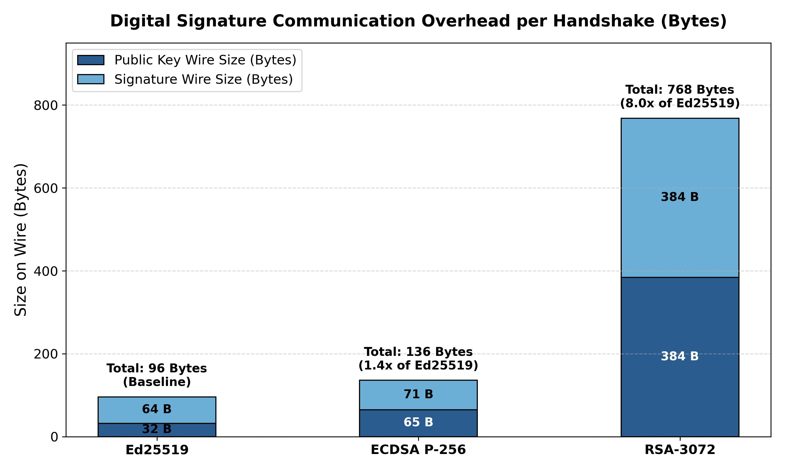
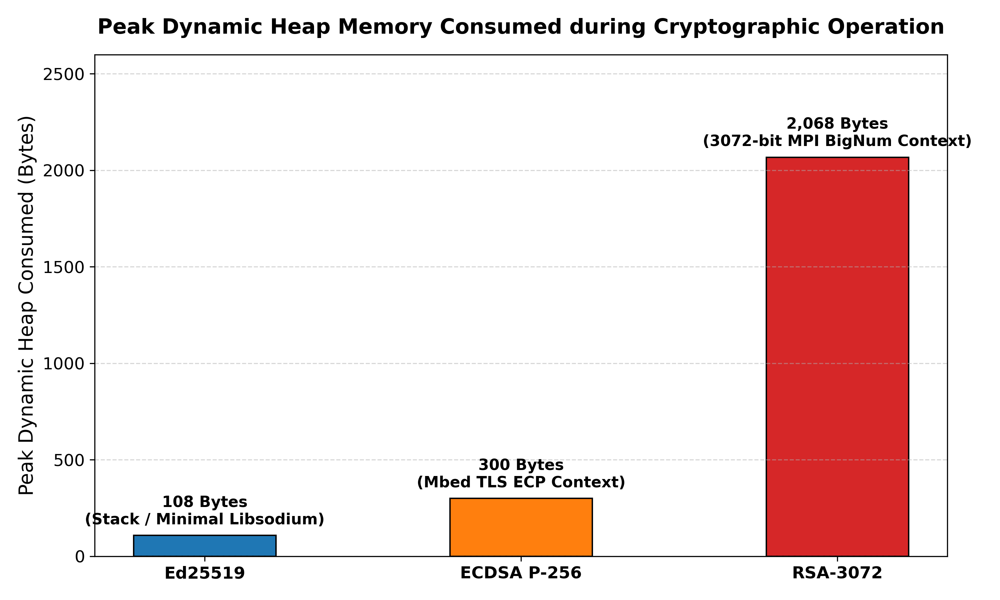

# Phase A: Isolated Micro-Benchmarks (Digital Signatures on ESP32)

Standalone benchmark implementation and results report evaluating digital signature algorithms on the ESP32 microcontroller at an equivalent 128-bit classical security baseline.

The evaluation profiles each algorithm in memory without Wi-Fi or network transport delays to select the optimal digital signature scheme for the embedded VPN client.

## Algorithms Tested

| Algorithm | Curve / Standard | Implementation Library |
| :--- | :--- | :--- |
| **Ed25519** | Twisted Edwards Curve25519 | libsodium |
| **ECDSA P-256** | NIST prime curve secp256r1 | ESP32 mbedTLS |
| **Classical RSA-3072** | PKCS#1 v1.5 with 3072-bit modulus | ESP32 mbedTLS |

## Test Environment

* **Microcontroller:** ESP32-D0WDQ6 (Revision v1.0), Dual Core Xtensa LX6
* **Clock Frequency:** 240 MHz (240,000,000 cycles/second)
* **Free SRAM at Startup:** ~329 KB
* **Measurement Mechanism:** Direct hardware cycle counter register (`ccount`)
  $$\text{Time (ms)} = \frac{\text{CPU Cycles}}{240,000}$$
* **Iteration Count:** 100 runs for fast tests (Ed25519 and ECDSA P-256); 10 runs for slow RSA key generation to prevent watchdog resets.

## Benchmark Results Summary

| KPI ID | Metric | Ed25519 | ECDSA P-256 | RSA-3072 | Winner |
| :--- | :--- | :---: | :---: | :---: | :---: |
| **SIG-1** | **Key Generation Time** | **8.56 ms** | 146.93 ms | 9,630.80 ms | **Ed25519** |
| **SIG-2** | **Public Key Wire Size** | **32 bytes** | 65 bytes | 384 bytes | **Ed25519** |
| **SIG-3** | **Message Signing Time (64-byte challenge)** | **9.42 ms** | 158.58 ms | 375.81 ms | **Ed25519** |
| **SIG-4** | **Signature Wire Size** | **64 bytes** | 71 bytes | 384 bytes | **Ed25519** |
| **SIG-5** | **Verification Time** | 19.80 ms | 313.88 ms | **1.71 ms** | **RSA-3072** |
| **SIG-6** | **Total Client Sign Time (SIG-1 + SIG-3)** | **17.99 ms** | 305.51 ms | 10,006.61 ms | **Ed25519** |
| **SIG-7** | **Peak Dynamic Heap RAM** | **108 bytes** | 300 bytes | 2,068 bytes | **Ed25519** |

## Hardware Workload (CPU Cycles @ 240 MHz)

| Metric | Ed25519 | ECDSA P-256 | RSA-3072 |
| :--- | :---: | :---: | :---: |
| **KeyGen Cycles** | **2,055,308** | 35,262,354 | 2,311,393,015 |
| **Signing Cycles** | **2,261,378** | 38,059,479 | 90,194,354 |
| **Verification Cycles** | 4,750,949 | 75,331,369 | **410,321** |
| **Total Client Sign Cycles** | **4,316,686** | 73,321,833 | 2,401,587,369 |

## Why Ed25519 Was Selected

Ed25519 is the selected digital signature algorithm for the VPN client based on four critical technical findings:

1. **Superior Execution Speed ($17\times$ faster than ECDSA):** Key generation takes **8.56 ms** and signing takes **9.42 ms**. Total client authentication completes in **17.99 ms**, compared to **305.51 ms** for ECDSA and **10,006.61 ms** (~10 seconds) for RSA-3072.
2. **Compact Network Payload ($8\times$ smaller than RSA):** Total handshake wire overhead (Public Key + Signature) is **96 bytes**, compared to 136 bytes for ECDSA and **768 bytes** for RSA. Smaller frames eliminate TCP packet fragmentation and minimize radio on-time.
3. **Minimal Heap Footprint ($19\times$ less RAM than RSA):** Allocates only **108 bytes** of peak dynamic heap memory, compared to **300 bytes** for ECDSA and **2,068 bytes** for RSA-3072's BigNum MPI context.
4. **Constant-Time Execution & Side-Channel Resistance:** Ed25519 operations over Twisted Edwards Curve25519 execute in constant time, preventing timing side-channel attacks, and derive nonces deterministically to eliminate the nonce collision vulnerability inherent to ECDSA.

While RSA verification is fast (1.71 ms), the client device must generate keys and sign challenges, where RSA's 9.6-second keygen, 376 ms signing, and 768-byte wire overhead make it impractical.

## Hardware Serial Output Verification

### Ed25519 Benchmark Terminal Output

### ECDSA P-256 Benchmark Terminal Output

### Classical RSA-3072 Benchmark Terminal Output

### Benchmark Results Summary Table

## Benchmark Visualizations

### Execution Latency Comparison (Log Scale)

### Communication Payload Overhead (Bytes)

### Dynamic Heap Memory Allocation (Bytes)

## How to Run the Benchmark

1. Open `Phase_A_Isolated_Benchmark.ino` in the Arduino IDE.
2. Select your board: **Tools > Board > ESP32 Arduino > ESP32 Dev Module**.
3. Set CPU Frequency to **240 MHz**.
4. Connect your ESP32 via USB and select the corresponding Serial port (`/dev/ttyUSB0` on Linux).
5. Upload the sketch and open the **Serial Monitor** at **115200 baud**.
6. The ESP32 will automatically run the benchmarks and print the cycle counts, converted timings, wire sizes, and peak dynamic heap RAM to the terminal.

## Files in this Directory

* **`Phase_A_Isolated_Benchmark.ino`**: Standalone Arduino sketch containing the benchmark implementation for Ed25519, ECDSA P-256, and RSA-3072.
* **`benchmark_report.tex`**: LaTeX source code for the comprehensive micro-benchmark report.
* **`benchmark_report.pdf`**: Compiled PDF reference documentation containing KPI definitions, comparison tables, serial output terminal captures, and pseudocode.
* **`generate_graphs.py`**: Python matplotlib script used to generate publication-grade comparison plots.
* **`graphs/`**: Directory containing the generated benchmark visualization plots.
* **`screenshots/`**: Directory containing the ESP32 hardware serial monitor captures.
