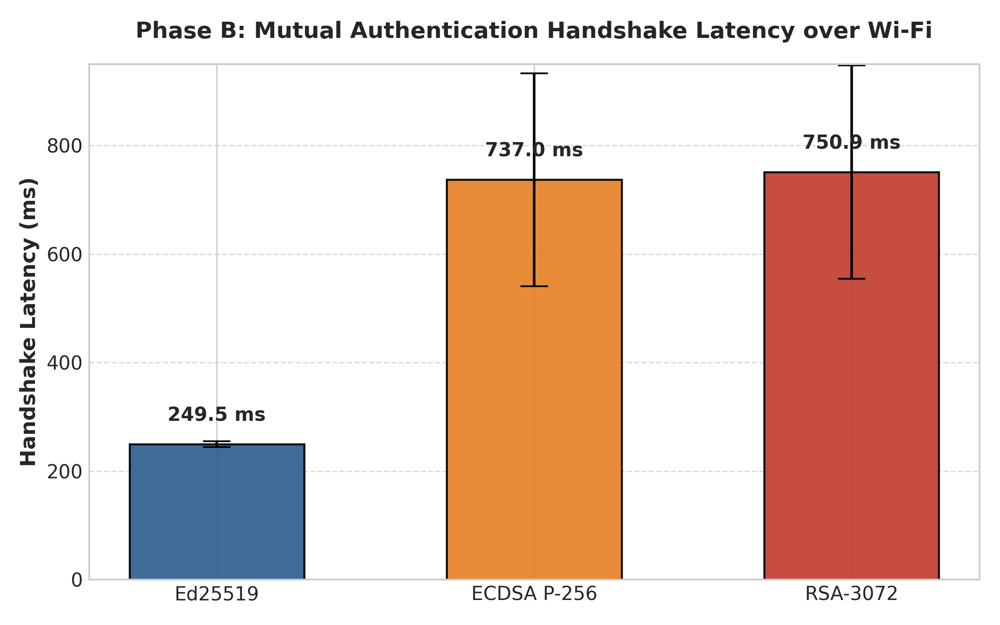
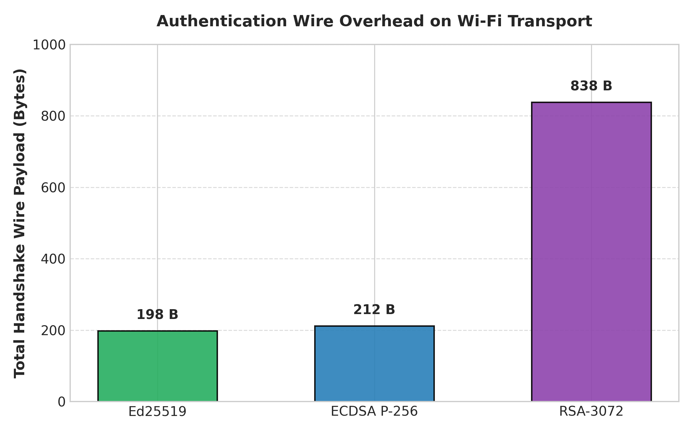
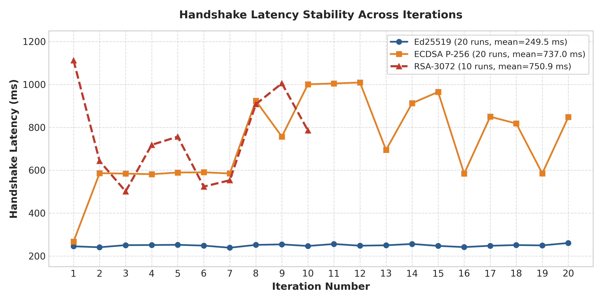

# Phase B: Integrated Network Benchmark (Mutual Authentication Handshake)

Network benchmark implementation and evaluation report measuring real-world mutual authentication handshakes between the ESP32 client and laptop server over local Wi-Fi and TCP sockets.

While Phase A evaluated raw cryptographic operations in isolated chip memory, Phase B profiles end-to-end handshake latency, network transmission overhead, and packet exchange under real embedded Wi-Fi conditions.

## Algorithms Tested

| Algorithm | Key Curve / Standard | Implementation Library | Wire Signature Size |
| :--- | :--- | :--- | :---: |
| **Ed25519** | Twisted Edwards Curve25519 | libsodium (ESP32) / cryptography (Server) | 64 bytes |
| **ECDSA P-256** | NIST prime curve secp256r1 | ESP32 mbedTLS / cryptography (Server) | ~71 bytes (DER) |
| **RSA-3072** | PKCS#1 v1.5 with SHA-256 | ESP32 mbedTLS / cryptography (Server) | 384 bytes |

## Test Environment

* **Client Node:** ESP32-D0WDQ6 Dual-Core Xtensa LX6 @ 240 MHz (IP: `10.27.228.175`)
* **Gateway Server:** Python 3.10+ running on Laptop (IP: `10.27.228.216`, TCP Port: 9000)
* **Transport:** TCP socket over IEEE 802.11 b/g/n local Wi-Fi
* **Handshake Protocol:** 3-Way mutual challenge-response:
  1. `[MSG1]` Server transmits 32-byte challenge nonce to ESP32
  2. `[MSG2]` ESP32 signs server challenge, generates 32-byte client challenge, and sends both back (Signature + Nonce)
  3. `[MSG3]` Server signs client challenge and returns its digital signature
  4. Both endpoints verify digital signatures before concluding the session

## Benchmark Results Summary

| Metric | Ed25519 | ECDSA P-256 | RSA-3072 | Winner |
| :--- | :---: | :---: | :---: | :---: |
| **Average Handshake Latency** | **249.48 ms** | 737.01 ms | 750.90 ms | **Ed25519 (3.0× faster)** |
| **Minimum Handshake Latency** | **238.71 ms** | 267.49 ms | 501.63 ms | **Ed25519** |
| **Maximum Handshake Latency** | **260.79 ms** | 1,009.39 ms | 1,112.68 ms | **Ed25519 (No latency spikes)** |
| **Latency Standard Deviation** | **5.28 ms** | 207.15 ms | 191.43 ms | **Ed25519 (Extremely stable)** |
| **Total Wire Payload (3 Messages)** | **198 Bytes** | 212 Bytes | 838 Bytes | **Ed25519 (4.2× lighter than RSA)** |
| **Handshake Success Rate** | **100% (20/20)** | **100% (20/20)** | **100% (10/10)** | All 100% |

## Why Ed25519 Was Selected for Live Networks

1. **3× Faster Connection Setup:** Ed25519 completed mutual authentication in **249.48 ms**, compared to **737.01 ms** for ECDSA and **750.90 ms** for RSA. For IoT sensor nodes that sleep and periodically wake to send readings, this reduces radio on-time and power consumption by 66%.
2. **Minimal Latency Jitter ($\sigma = 5.28\text{ ms}$):** Ed25519 produced consistent completion times across all 20 runs (ranging tightly between 238.71 ms and 260.79 ms). In contrast, ECDSA and RSA fluctuated between 267 ms and 1,112 ms ($\sigma \approx 200\text{ ms}$), introducing unpredictable connection delays.
3. **Compact Frame Size (198 Bytes vs. 838 Bytes):** Ed25519 exchanged only 198 bytes across the entire 3-way handshake. RSA required 838 bytes ($4.2\times$ more traffic), consuming excessive Wi-Fi airtime and increasing vulnerability to wireless packet drops.

## Benchmark Visualizations

### Average Handshake Latency Comparison

### Authentication Wire Overhead

### Handshake Latency Stability Across Iterations

## Files in this Directory

* **`Phase_B_Network_Benchmark.ino`**: ESP32 Arduino sketch executing the 3-way handshake benchmarks.
* **`benchmark_server.py`**: Python TCP gateway server running the mutual authentication verification loops.
* **`benchmark_report.pdf`**: Complete PDF reference report containing KPI definitions, full iteration logs, terminal screenshots, and protocol pseudocode.
* **`graphs/`**: High-resolution Matplotlib benchmark plots.
* **`screenshots/`**: Terminal captures recorded during live execution.
* **`README.md`**: Technical overview and execution instructions.
