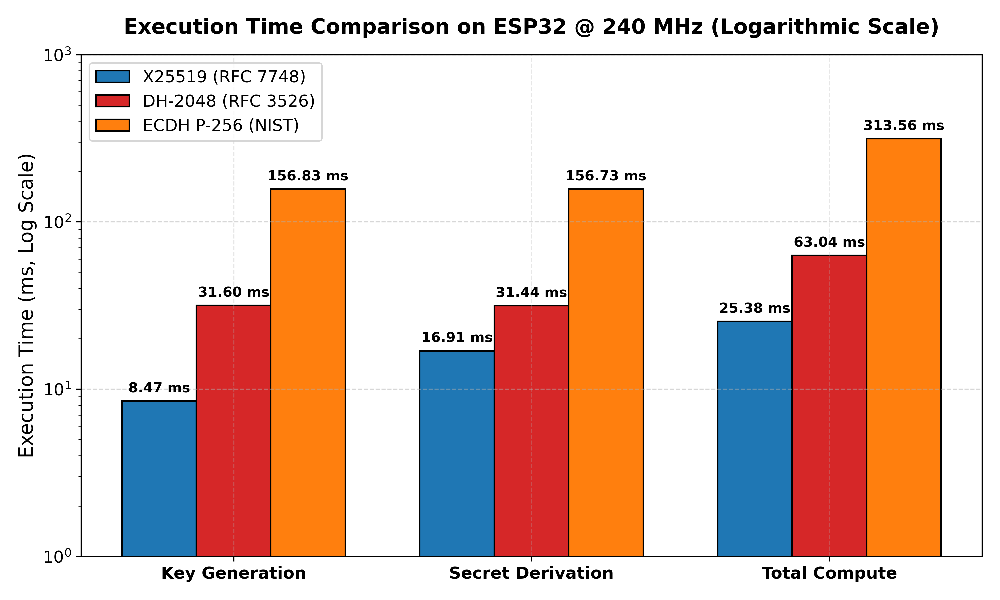
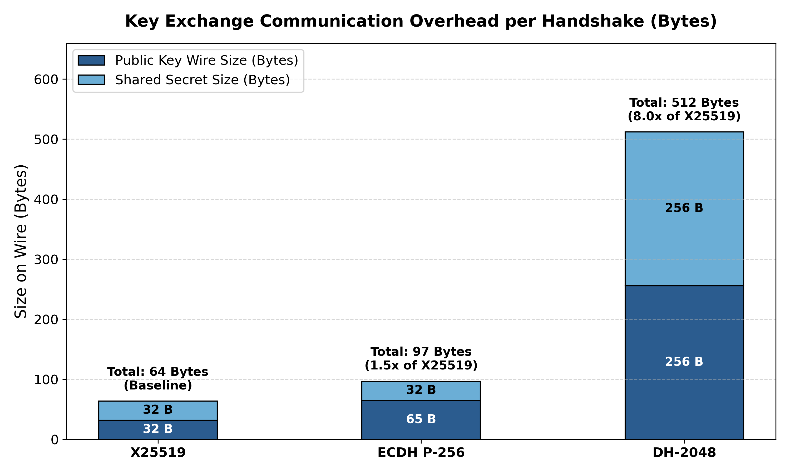
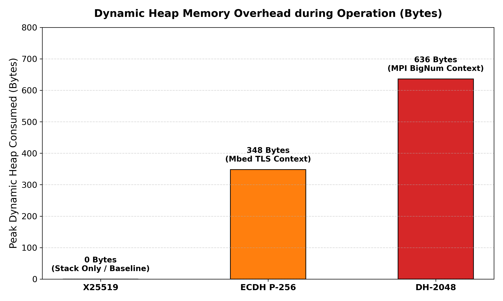
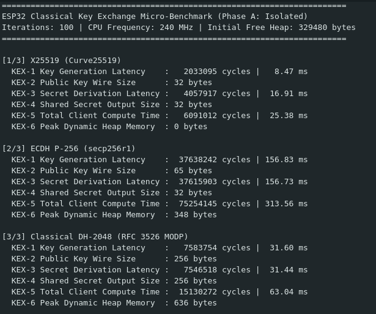
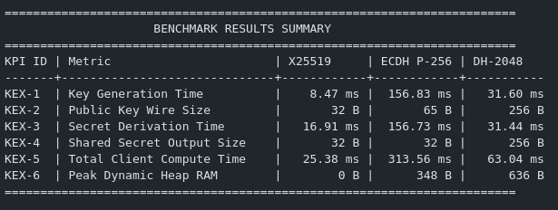

# Phase A: Isolated Micro-Benchmarks (Classical Key Exchange on ESP32)

Standalone benchmark implementation and results report evaluating classical (traditional) key exchange algorithms on the ESP32 microcontroller at an equivalent 128-bit classical security baseline.

The evaluation profiles each algorithm in memory without Wi-Fi or network transport delays to isolate and quantify pure on-chip cryptographic performance, CPU cycle consumption, memory footprint, and wire transmission overhead for the embedded IoT VPN client.

## Algorithms Tested

| Algorithm | Curve / Standard | Implementation Library | Classical Security |
| :--- | :--- | :--- | :---: |
| **X25519** | Montgomery Curve25519 (RFC 7748) | Libsodium | 128-bit |
| **ECDH P-256** | NIST Weierstrass Curve (secp256r1) | ESP32 Mbed TLS | 128-bit |
| **Classical DH-2048** | Finite Field MODP Group 14 (RFC 3526) | ESP32 Mbed TLS (MPI) | 112-bit (Legacy) |

## Test Environment

* **Microcontroller:** ESP32-D0WDQ6 (Revision v1.0), Dual Core Xtensa LX6
* **Clock Frequency:** 240 MHz (240,000,000 cycles/second)
* **Usable SRAM:** ~320 KB (Initial Free Heap: 329,480 bytes)
* **Measurement Mechanism:** Direct hardware cycle counter register (`ccount` via inline assembly `rsr %0, ccount`)
  $$\text{Time (ms)} = \frac{\text{CPU Cycles}}{240,000}$$
* **Iteration Count:** $N = 100$ runs per algorithm to obtain stable arithmetic means.

## Benchmark Results Summary

| Metric | KPI ID | X25519 | ECDH P-256 | Classical DH-2048 | Winner |
| :--- | :---: | :---: | :---: | :---: | :---: |
| **Key Generation Time** | KEX-1 | **8.47 ms** (2.03 M cycles) | 156.83 ms (37.64 M cycles) | 31.60 ms (7.58 M cycles) | **X25519** |
| **Public Key Wire Size** | KEX-2 | **32 bytes** | 65 bytes | 256 bytes | **X25519** |
| **Secret Derivation Time** | KEX-3 | **16.91 ms** (4.06 M cycles) | 156.73 ms (37.62 M cycles) | 31.44 ms (7.55 M cycles) | **X25519** |
| **Shared Secret Output Size** | KEX-4 | 32 bytes | 32 bytes | 256 bytes | **X25519 / P-256** |
| **Total Client Compute Time** | KEX-5 | **25.38 ms** (6.09 M cycles) | 313.56 ms (75.25 M cycles) | 63.04 ms (15.13 M cycles) | **X25519** |
| **Peak Dynamic Heap RAM** | KEX-6 | **0 bytes** (Stack only) | 348 bytes | 636 bytes | **X25519** |

## Why X25519 Was Selected

X25519 is the selected key exchange scheme for the classical ESP32 VPN client based on five technical findings:

1. **Computational Speed:** Total client computation (KeyGen + Derivation) completes in **25.38 ms** ($12.35\times$ faster than ECDH P-256 and $2.48\times$ faster than Classical DH-2048). On battery-powered IoT microcontrollers that wake from deep sleep, this minimizes active CPU energy consumption.
2. **Compact Wire Payload:** The public key is only **32 bytes** ($2.03\times$ smaller than P-256 and $8.0\times$ smaller than DH-2048's 256-byte payload). It fits comfortably within single-packet envelopes without network fragmentation, reducing Wi-Fi radio on-time.
3. **Zero Dynamic Heap Overhead:** Consumed **0 bytes** of dynamic heap RAM during execution, operating entirely on the local stack frame. In contrast, ECDH P-256 consumed **348 bytes** and DH-2048 consumed **636 bytes** for multi-precision integer contexts, introducing memory fragmentation risks.
4. **Constant-Time Timing & Side-Channel Resistance:** X25519 uses the **Montgomery ladder**, which naturally executes in constant time regardless of the private key value, preventing timing side-channel attacks. Furthermore, any 32-byte sequence represents a valid Curve25519 point, eliminating point-on-curve validation overhead.
5. **Standardized RFC 3526 Prime for DH-2048:** Dynamic runtime safe prime generation ($p = 2q + 1$) on ESP32 is mathematically intractable (requiring minutes of primality tests and triggering watchdog panics). Using the standardized RFC 3526 2048-bit MODP prime ensures instant initialization and prevents small-subgroup confinement attacks.

## Benchmark Visualizations

### Execution Latency Comparison (Log Scale)

### Communication Payload Overhead

### Dynamic Heap Memory Allocation

## Serial Monitor Output Verification

### Detailed Per-Algorithm Execution Output

### Benchmark Results Summary Table

## How to Run the Benchmark

1. Open `Phase_A_Isolated_Benchmark.ino` in the **Arduino IDE**.
2. Select your board: **Tools > Board > ESP32 Arduino > ESP32 Dev Module**.
3. Set CPU Frequency to **240 MHz**.
4. Connect your ESP32 via USB and select the serial port (`/dev/ttyUSB0` on Linux or `COMx` on Windows).
5. Upload the sketch and open the **Serial Monitor** at **115200 baud**.
6. The ESP32 will automatically run 100 iterations of X25519, ECDH P-256, and DH-2048, and print the cycle counts, converted millisecond timings, wire sizes, and heap usage.

## Files in this Directory

* **`Phase_A_Isolated_Benchmark.ino`**: Standalone Arduino sketch containing the automated benchmark suite for X25519, ECDH P-256, and Classical DH-2048.
* **`benchmark_report.pdf`**: Complete PDF reference documentation containing KPI definitions, comparison tables, serial output terminal captures, and pseudocode.
* **`benchmark_report.tex`**: Full LaTeX source code used to compile the academic PDF report.
* **`generate_graphs.py`**: Python script using Matplotlib to generate the high-resolution comparison plots.
* **`graphs/`**: Directory containing the benchmark visualization plots (`fig_timing_comparison.png`, `fig_size_overhead.png`, `fig_memory_comparison.png`).
* **`screenshots/`**: Directory containing the hardware terminal output screen captures (`terminal_detailed_runs.png`, `terminal_summary_table.png`).
